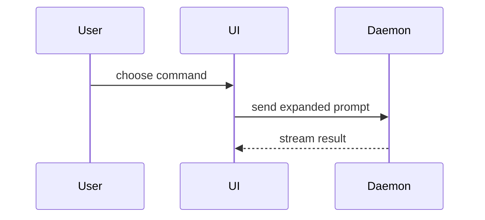

Use this template for writing the PR body:

```markdown
## Summary

<diagram, diff-sketch, or tree>

## Read Closely

### 1. <succinct title>

`<path/to/file.rb:line>`: <what this code does, one or two sentences>

**Why it matters:** <the consequence of a mistake here: security, production data, money, access, blast radius>

## Evidence

- **Before:** <screenshot/output/failing test run>
  **After:** <screenshot/output/passing test run>

## Merge Danger

**Door:** <one-way or two-way>

<optional: description>

**Blast Radius:** <one-word description>

<optional: potential ramifications of merge>

## Interface

| Entry point | What it does | Who / where |
| --- | --- | --- |
| <command with its args, or route> | <one line> | <who can reach it, which environment> |

## Before Merge

- [ ] <prep or manual verification that must happen before merging>

## Before Deploy

- [ ] <prep that must happen before this reaches production>

## After Deploy

- [ ] <post-deploy check or thing to watch, with where to look>
```

Read Closely, Interface, Before Merge, Before Deploy and After Deploy are optional: include each only when it has at least one entry, and never write "None".

Below the last section, append any lines the caller, the repo's instructions or the issue require in a PR body, verbatim and each on its own line: closing keywords (`Closes #123`, `Closes ClickUp #86aghyq0r`), mentions, and the like. The template never replaces them, and never add lines those instructions forbid.

## Sections

Skip all preambles and keep prose brief. Use the user's domain language from `GLOSSARY.md`.

### Summary

Pick the smallest view that makes the key point clear.

- Show logic or an algorithm as pseudocode:

```text
on(save)
  if content is unchanged
    return cached result
  write new content
  return fresh result
```

- Show runtime control flow as a call tree:

```text
submitForm
  createSession
    persistPrompt
    launchAgent
  navigateToSession
```

- Show UI structure as a component tree, including state and module boundaries that matter:

```text
<SessionPage> (apps/example/src/routes/session.tsx)
  useSessionEvents()
  <SessionToolbar>
    <RunSkillButton> (packages/ui)
```

- Show file responsibility or a broad refactor as a shallow file tree:

```text
src/
├── commands/       # parses user actions
├── sessions/       # owns session state
└── transport/      # sends API requests
```

- Show component interaction, control flow, or data flow with Mermaid:



- Use `diff` when the point is what changes and the surrounding shape already exists. Match the diff shape to the topic.

For a component change:

```diff
 <SessionPage>
   useSessionEvents()
   <SessionToolbar>
+    <RunSkillButton />
   <SessionTimeline>
+    <SkillResultCard />
```

For a file-layout change:

```diff
 src/
 ├── commands/
+│   └── show-me.ts       # expands the slash command
 ├── sessions/
-└── transport.ts
+└── transport/
+    ├── client.ts
+    └── stream.ts
```

For a call-tree or call-stack change:

```diff
 submitForm
   createSession
     persistPrompt
+    expandSkillMention
     launchAgent
-  navigateToSession
+  navigateToSession
+    subscribeToEvents
```

For a state or control-flow change:

```diff
 on(save)
-  write content
+  if content is unchanged
+    return cached result
+  write new content
+  invalidate cache
```

- Show the whole block when most of it is new, when omitted context would hide ownership or order, or when the user needs a copyable target shape:

```ts
function expandSkill(command: string): string {
  const skillName = command.slice(1);
  return `use the ${skillName} skill`;
}
```

#### Guidance

Place each visual next to the short text it supports. Keep only the calls, files, props, states, and boundaries needed to answer the user's current question or the options to resolve the current discussion point.

You may use one of these, you may use several, it is unlikely you will use all of them. Use your judgement and don't overwhelm the user.

### Read Closely

The few places a reviewer must understand, for a reviewer who doesn't know this code. At most three items, and usually fewer. Filter hard: include an item only when a mistake there would be a security hole, a write to production data, a money error, an access-control gap, or a wide blast radius. Leave out implementation detail, edge cases with no user-facing consequence, and anything only the author can judge; those belong in the commit messages. A long list gets skipped entirely, which defeats the section.

Each item is a numbered `###` heading with a succinct title, then the file and line reference, then one or two sentences on what the code does and what the reviewer should confirm, then a bold **Why it matters:** line naming the consequence.

### Evidence

Concrete evidence that the change works. Show a before and after.

Screenshots are S-tier - when the environment is set up for it and the change is visual.

Execution-based evidence is A-tier. Test results, console output. Show the exact test that now fails and passes, using pseudocode.

### Merge Danger

Describe whether it's a one-way or two-way door. You can walk back through two-way doors, but not one-way doors. A PR that is cheap to roll back is lower risk. Changes that involve destructive actions or hard-to-reverse decisions are one-way doors.

The blast radius is the potential impact or scope of the changes introduced by this PR. Consider all possibilities. Examples are layout shift, breakages for consumers, mobile responsiveness, etc.

### Interface

A terse cheatsheet for whoever verifies the change: every entry point this PR adds or changes that a person can invoke directly, such as CLI commands and tasks with their arguments, routes and pages, scripts, console or REPL entry points, config keys and feature flags. One row each, with the exact invocation (every argument, and which are optional), what it does in a few words, and who can reach it where. Flag anything that writes, sends or charges, and its dry-run form if there is one. Leave out internal methods nobody calls by hand.

### Before Merge, Before Deploy, After Deploy

Checklists of actions that sit outside the diff, each item concrete enough to tick off.

- **Before Merge:** prep and manual verification that gates the merge, such as checking the UI in a browser or confirming an external setting.
- **Before Deploy:** prep that must land before the code reaches production, such as config, credentials, data backfills, or telling the people affected.
- **After Deploy:** what to verify or watch once it's live, with where to look (a dashboard, a log query, an error tracker) and what a bad sign would be.

List only open, blocking items. A decision already made, or an item already verified, belongs in the commit messages or the issue, not here.
